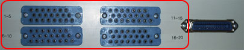
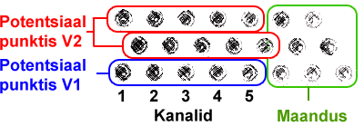
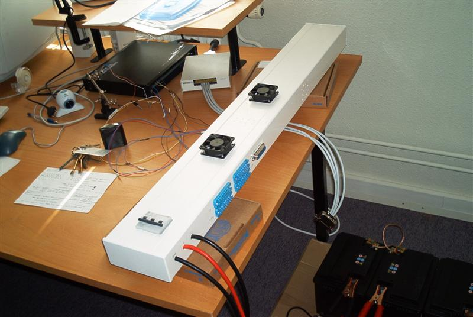
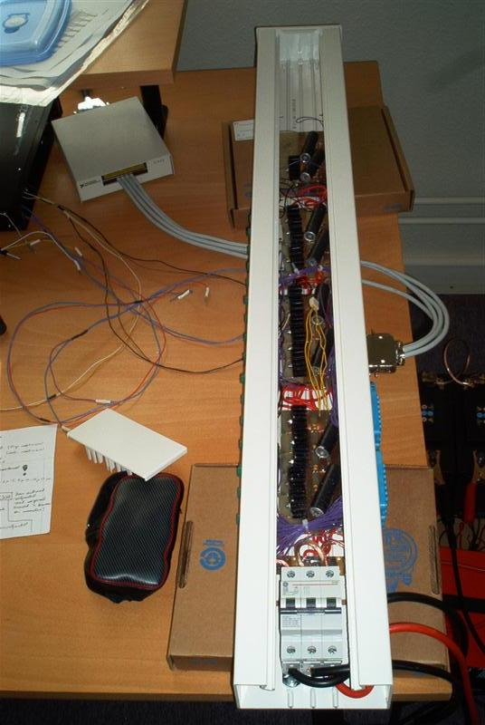

16 Channel Operational Amplifier
--------------------------------

.. _legacy:

Project summary
^^^^^^^^^^^^^^^

My assignment was to build a 16 channel current amplifier 
with various voltage and current measurment outputs. 
The device consists of 16 operational amplifiers, lots of wiring, 
and cooling radiators. 4 car batteries can be used as power source. 
This amplifier has been used a lot for working with IPMC 
electroactie polymer (really power demanding). 
The project was finished in July 2004. 
The cost of the amplifier was about 400$ (excluding labor).

(The rest of the documentation is in Estonian)

Tehniline info
^^^^^^^^^^^^^^

Tegemist on 16 kanalise toiteplokiga, mis sai valmistatud, 
tüürimaks kunstlihaseid, kuna viimased vajavad mitmeamprist 
voolu ja kontrollitud sisendpinget.

Võimendina on kasutusel LM675 kivid, mille võimendustegur on üks. 
Pinge tüürimiseks on esipaneelil Centronics pistik (36pin), 
kus iga kanali kohta käib pinge ja maandus. 
Maksimaalne vool ühest kanalist on 3A. Kui vool ületab 3A, 
võib rakenduda LM675 termokaitse ja vastava kanali operatsioonvõimendi 
välja lülitada. Väljundiks on 16 banaanpistikut ja 4 banaanpistikut maandusega.
Toitepinge peab operatsioonvõimendite funktsioneerimiseks olema 16..60V. 
Toitevool läbib automaatkaitsmeid, mis peavad vastu 32A.

Eralduva soojuse ärajuhtimiseks on operatsioonvõimendid 
varustatud radiaatoritega ning lisaks sellele on korpusele 
monteeritud kaks sissepoole puhuvat ventilaatorit, 
tagades korraliku õhu ringluse.

Vältimaks võnkeringide teket operatsioonvõimendi tagasiside ahelas, 
on viimane varustatud väikese mahtuvuseliste kondensaatoritega. 
2200uF kondensaatorid on pandud ka +/- toitepinge ja maanduse vahele,
et vältida madalsageduslikke võnkumisi väljundis.

Iga kanali jaoks on ka olemas pinge ja voolu mõõtmise klemmid. 
Väljundvoolu mõõdetakse pingelanguga 0.15ohm takistil.

Sisendid, väljundid, mõõteklemmid
^^^^^^^^^^^^^^^^^^^^^^^^^^^^^^^^^

*Sisendiks* kasutatakse Centronics 36 klemmilist, female kontakti. 
Alumine rida on sisendpinge ja ülemine maandus.

*Väljundiks* on banaanpistiku kontakti kanali kohta + 4 maanduspesa.

*Mõõtmiseks* on korpusel 4 mitme väljundkontaktiga pesa:

Kanaleid loetakse vasakult paremale. Iga pesa ülemise rea 
esimesel 5 klemmil saab mõõta potentsiaali väljundil.
Kahe alumise rea 5 esimest klemmi on pingelangu mõõtmiseks 0.15 ohm takistil. 
Ülejäänud klemmid on maanduseks:

Ühe kanali skeemi saab :download:`siit `. 
Komponentide paigutust plaadil näeb :download:`siin `.

Pilte
^^^^^

	
	Pealt vaade

	Avatud kaanega

