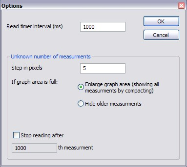
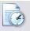
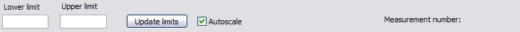

Spectro - Data Analyzer for a CCD Camera
----------------------------------------

Spectro is an application for displaying graphs in real time. 
Data source is a file, specified by the user. 
Spectro is able to read the file in real time and display the 
data in several different ways. 
It also allows one to convert the acquired data to the ASCII XY format.

Quick reference
^^^^^^^^^^^^^^^

Most of the commands are accessible from the menu or from 
the toolbar of the application. Automatic operating mode 
and conversion tools can be accessed only from the toolbar:

Commands
""""""""

The applications has the following commands/functionality:

**Open**

Opens an input file if possible. The file won't be read 
and no graph will be drawn. The file name can be seen in the status bar. 
Only one file can be opened at any time. Already opened file will 
be unloaded upon opening another file.

**Scan**

Initiates reading the file and displaying the graph. If there is no file
opened, the Open command will be invoked first. Most of the functionality
is disabled during the scannign process.

.. figure:: img/spectrostop.jpg
	:align: left 
	:figwidth: 100

**Stop**

The stop button is active only during scanning. The scanning stops
after clicking stop, however, data and graph will **not** be deleted.

**Options**

Shows the options dialog box: 

* Timer interval - shows the scanning period in milliseconds. It should be less than the file writing period (i.e. if a program writes data to the file in every 100ms, the timer interval should be at least 100ms, preferably less than that). Keeping timer interval very low (e.g. 10ms) does not affect the performance of the system remarkably.
* Step in pixels - Shows width of one measurement in the graph (in pixels). By changing this variable it’s possible to narrow or widen the graph.
* If graph area is full – if "enlarge the graph area" is chosen the graph will be compacted 10% after becoming full. Otherwise older measurements will be continuously hidden.
* Stop reading after - if checked the program stops reading automatically after specified number of measurements. The file won’t be unloaded and the graph remains as it is.

**Quit**

Stops reading the file and closes the application.

**Automatic mode**

This is a toggle button and can be switched ON or OFF. 
It is possible to switch it ON only when program is not scanning. 
If the button is ON, *open, start scanning, and stop scanning* will 
be disabled. The program checks automatically for input 
filename (from **input.inf**). If a valid filename is found and the 
file can be opened, *Automatic mode* will be switched OFF and the 
program starts scanning from the file. If incorrect filename 
(i.e. cannot found the file) is found from input.inf, the program 
will give a warning and *Automatic mode* will be switched off. 
After finding any filename from input.inf, 
contents of input.inf will be erased. NB!! After switching ON 
automatic mode, **all** existing graph data from the 
program memory will be erased and any loaded file will be unloaded.

**Convert**

Can be accessed from the menu. Opens a dialog box, where the loaded data can
be converted to the ASCII XY format.

**Scaling and measurement number**

Lower and upper limit specify the vertical range of the graph. It’s possible to use automatic scaling by checking autoscale. 
Measurement number shows the number of the latest measurement (the value is on the right side of the graph).

General guidelines
""""""""""""""""""

Here are some general guidelines, how to use the software with Andor CCD camera and scripting environment.
The most common way: 

* Open Andor and load Spectro.pgm (e.g. located at C:\Spectro, could be downloaded in download section) from File->Run program by filename.
* Run Spectro.exe (C:\Spectro\Spectro.exe). Switch ON Automatic mode.
* Go back to the Andor window and "run" button on the toolbar to run Spectro.pgm. After that a filename will be asked. Write the filename and click OK. The filename will be written to file input.inf for the automatic mode.
* Go back to the Spectro and you should see the graph. If there are any problems (graph doesn’t seem to be real time, etc), try to change the options (e.g. decrease read time interval).

More general way:

* Open Andor and load Spectro.pgm (located at C:\Spectro) from File->Run program by filename.
* Run Spectro.exe (C:\Spectro\Spectro.exe).
* Go back to the Andor and to click “run” button on the toolbar to run Spectro.pgm. After that a filename will be asked. Write the filename and click OK.
* Go back to the Spectro application window and click oni the Start scanning button. Choose the file name that was entered before. Click OK and you should see a graph.

Downloads
"""""""""
Source code of Spectro is :download:`here <download/spectrosource.tgz>`. 
Script for Andor CCD scripting environment is :download:`here <download/AndorSpectro.pgm>`.

