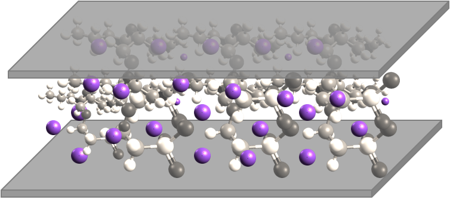

Poisson Nernst-Planck Equation
==============================

This section describes how to make a weak form presentation
of Poisson and Nernst-Planck equation system. The Nernst-Planck
equation is often used to describe the diffusion, convection,
and migration of charged particles:

.. math::
	:label: nernstplanck

		\frac {\partial C} {\partial t} + \nabla \cdot 
		(-D\nabla C - z \mu F C \nabla \phi) = 
		- \vec {u} \cdot \nabla C.

The second term on the left side is diffusion and the third term is
the migration that is directly related to the the local voltage
(often externally applied) $\phi$. The term on the right side is
convection. This is not considered in the current example. The variable
$C$ is the concentration of the particles at any point of a domain
and this is the unknown of the equation.

One application for the equation is to calculate charge configuration
in ionic polymer transducers. Ionic polymer-metal composite is
for instance an electromechanical actuator which is basically a thin
polymer sheet that is coated with precious metal electrodes on both
sides. The polymer contains fixed anions and mobile cations such
as $H^{+}$, $Na^{+}$ along with some kind of solvent, most often water.

When an voltage $V$ is applied to the electrodes, the mobile cations
start to migrate whereas immobile anions remain attached to the polymer
backbone. This creates spatial charges, especially near the electrodes.
One way to describe this system is to solve Nernst-Planck equation
for mobile cations and use Poisson equation to describe the electric
field formation inside the polymer. The poisson equation is

.. math::
	:label: poisson

		\nabla \cdot \vec{E} = \frac{F \cdot \rho}{\varepsilon},

where $E$ could be written as $\nabla \phi = - \vec{E}$ and $\rho$ is
charge density, $F$ is the Faraday constant and $\varepsilon$ is dielectric
permittivity. The term $\rho$ could be written as:

.. math::
	:label: rho
	
		\rho = C - C_{anion},
		
where $C_{anion}$ is a constant and equals anion concentration. Apparently
for IPMC, the initial spatial concentration of anions and cations are equal.
The inital configuration is shown:

The purploe dots are mobile cations. When a voltage is applied, the anions
drift:

.. image:: img/IPMC_bent.png
	:align: center
	:width: 385
	:height: 290
	:alt: Bent IPMC

This eventually results in actuation (mostly bending) of the material (not considered in this section).

To solve equations :eq:`nernstplanck` and :eq:`poisson` boundary conditions must be specified as well.
When solving in 2D, just a cross section is considered. The boundaries are
shown in: 

.. image:: img/IPMC_schematic.png
	:align: center
	:width: 409 
	:height: 140
	:alt: IPMC boundaries

For Nernst-Planck equation :eq:`nernstplanck`, all the boundaries have the same, insulation
boundary conditions:

.. math::
	:label: nernstboundary

	-D \frac{\partial C}{\partial n} - z \mu F C \frac{\partial \phi} {\partial n} = 0

For Poisson equation:

 #. (positive voltage): $\frac{\partial \phi}{\partial n} = -E_{applied}$. We cannot apply just Dirichlet boundary, i.e. $\phi = 3V$ as then :eq:`nernstplanck` would not converge in time. It means that the charge accumulation near the boundary would increase continually. 
 #. (ground): Dirichlet boundary $\phi = 0$.
 #. (insulation): Neumann boundary $\frac{\partial \phi}{\partial n} = 0$.

Weak Form of the Equations
--------------------------

To implement the :eq:`nernstplanck` and :eq:`poisson` in Hermes2D, the weak form must be derived. First of all let's denote:

* $K=z \mu F$
* $L=\frac{F}{\varepsilon}$

So equations :eq:`nernstplanck` and :eq:`poisson` can be written:

.. math::
	:label: nernstplancksimple
		
		\frac{\partial C}{\partial t}-D\Delta C-K\nabla\cdot \left(C\nabla\phi\right)=0,

.. math::
	:label: poissonsimple

		-\Delta\phi=L\left(C-C_{0}\right),

Then the boundary condition :eq:`nernstboundary` becomes

.. math::
	:label: nernstboundarysimple

		-D\frac{\partial C}{\partial n}-KC\frac{\partial\phi}{\partial n}=0.

Weak form of equation :eq:`nernstplancksimple` is:

.. math::
	:label: nernstweak1

		\int_{\Omega}\frac{\partial C}{\partial t}v
		-\int_{\Omega}D\Delta Cv-\int_{\Omega}K\nabla C\cdot
		\nabla\phi v - \int_{\Omega}KC\Delta \phi v=0,

where $v$ is a test function. When applying
Green's first identity to expand the terms that contain Laplacian
and adding the boundary condition :eq:`nernstboundarysimple`, the :eq:`nernstweak1`
becomes:

.. math::
	:label: nernstweak2

		\int_{\Omega}\frac{\partial C}{\partial t}v+
		D\int_{\Omega}\nabla C\cdot\nabla v-
		K\int_{\Omega}\nabla C \cdot \nabla \phi v+
		K\int_{\Omega}\nabla\left(Cv\right)\cdot \nabla v-
		D\int_{\Gamma}\frac{\partial C}{\partial n}v-
		\int_{\Gamma}K\frac{\partial\phi}{\partial n}Cv=0,

where the terms 5 and 6 equal $0$ due to the boundary condition. 
By expanding the nonlinear 4th term, the weak form becomes:

.. math::
	:label: nernstweak3

		\int_{\Omega}\frac{\partial C}{\partial t}v+
		D\int_{\Omega}\nabla C \cdot \nabla v-
		K\int_{\Omega}\nabla C \cdot \nabla \phi v+
		K\int_{\Omega}\nabla \phi \cdot \nabla C v+
		K\int_{\Omega} C \left(\nabla\phi\cdot\nabla v\right)=0

As the terms 3 and 4 are equal and cancel out, the final weak form of equation
:eq:`nernstplancksimple` is

.. math::
	:label: nernstweak4

		\int_{\Omega}\frac{\partial C}{\partial t}v+
		D\int_{\Omega}\nabla C \cdot \nabla v+
		K\int_{\Omega} C \left(\nabla\phi\cdot\nabla v\right)=0
		
The weak form of equation :eq:`poissonsimple` with test function $u$ is:

.. math::
	:label: poissonweak1

		-\int_{\Omega}\Delta\phi u-\int_{\Omega}LCu+
		\int_{\Omega}LC_{0}u+\int_{\Gamma}\frac{\partial \phi}{\partial n}u=0.

After expanding the Laplace' terms, the equation becomes:

.. math::
	:label: poissonweak2

		\int_{\Omega}\nabla\phi\cdot\nabla u-\int_{\Omega}LCv+
		\int_{\Omega}LC_{0}u +\int_{\Gamma}\frac{\partial \phi}{\partial n}u=0,

where the last term could be written $-\int_{\Gamma}E_{applied}u$.

Jacobian matrix
---------------

Equation :eq:`nernstweak3` is time dependent, thus some time stepping 
method must be chosen. For simplicity we start with first order Euler implicit method

.. math::
	:label: euler

		\frac{\partial C}{\partial t} \approx \frac{C^{n+1} - C^n}{\tau}

where $\tau$ is the time step. We will use the following notation:

.. math::
	:label: cplus

		C^{n+1} = \sum_{k=1}^{N^C} y_k^{C} v_k^{C}, \ \ \ 
		  \phi^{n+1} = \sum_{k=1}^{N^{\phi}} y_k^{\phi} v_k^{\phi}.

In the new notation, time-discretized equation :eq:`nernstweak3` becomes:

.. math::
	:label: Fic

		F_i^C(Y) = \int_{\Omega} \frac{C^{n+1}}{\tau}v_i^C - \int_{\Omega} \frac{C^{n}}{\tau}v_i^C
		+ D\int_{\Omega} \nabla C^{n+1} \cdot \nabla v_i^C  
		+ K \int_{\Omega}C^{n+1} (\nabla \phi^{n+1} \cdot \nabla v_i^C v_i^C),

and equation :eq:`poissonweak2` becomes:

.. math::
	:label: Fiphi

		F_i^{\phi}(Y) = \int_{\Omega} \nabla \phi^{n+1} \cdot \nabla v_i^{\phi} 
		- \int_{\Omega} LC^{n+1}v_i^{\phi} + \int_{\Omega} LC_0 v_i^{\phi}
		- \int_{\Gamma} E_{applied}v_i^{\phi}

The Jacobian matrix $DF/DY$ has $2\times 2$ block structure, with blocks 
corresponding to

.. math:: 
	:label: jacobianelements

		\frac{\partial F_i^C}{\partial y_j^C}, \ \ \ \frac{\partial F_i^C}{\partial y_j^{\phi}}, \ \ \ 
		\frac{\partial F_i^{\phi}}{\partial y_j^C}, \ \ \ \frac{\partial F_i^{\phi}}{\partial y_j^{\phi}}.

Taking the derivatives of $F^C_i$ with respect to $y_j^C$ and $y_j^{\phi}$, we get

.. math::
	:label: bilin1

		\frac{\partial F_i^C}{\partial y_j^C} = 
		\int_{\Omega} \frac{1}{\tau} v_j^C v_i^C + D\int_{\Omega} \nabla v_j^C \cdot \nabla v_i^C
		+ K\int_{\Omega} v_j^C (\nabla \phi^{n+1} \cdot \nabla v_i^C),
	
.. math::
	:label: bilin2
		
		\frac{\partial F_i^C}{\partial y_j^{\phi}} =
		K \int_{\Omega} \nabla v_j^{\phi} \cdot \nabla C^{c+1} v_i^C 
		+ K \int_{\Omega} C^{n+1} (\nabla v_j^{\phi} \cdot \nabla v_i^C).

Taking the derivatives of $F^{\phi}_i$ with respect to $y_j^C$ and $y_j^{\phi}$, we get

.. math::
	:label: bilin3
		
		\frac{\partial F_i^{\phi}}{\partial y_j^C} =
		- \int_{\Omega} L v_j^C v_i^{\phi},

.. math::
	:label: bilin4
		
		\frac{\partial F_i^{\phi}}{\partial y_j^{\phi}} =
		\int_{\Omega} \nabla v_j^{\phi} \cdot \nabla v_i^{\phi}.

In Hermes, equations :eq:`Fic` and :eq:`Fiphi` are used to define the residuum $F$, and
equations :eq:`bilin1` - :eq:`bilin4` to define the Jacobian matrix $J$.

Simulation
----------

To begin with simulations in Hermes2D, the equations :eq:`Fic` - :eq:`bilin4` must be implemented.
It is done by implementing the callback functions found in  `newton-np-timedep-adapt-system/forms.cpp <http://hpfem.org/git/gitweb.cgi/hermes2d.git/blob/HEAD:/examples/newton-np-timedep-adapt-system/forms.cpp>`_.

The functions along with the boundary conditions::

	// Poisson takes Dirichlet and Neumann boundaries
	int phi_bc_types(int marker) {
		return (marker == SIDE_MARKER || marker == TOP_MARKER)
			? BC_NATURAL : BC_ESSENTIAL;
	}
	
	//Nernst-Planck takes Neumann boundaries
	int C_bc_types(int marker) {
		return BC_NATURAL;
	}
	
	//Dirichlet boundary conditions for Poisson equation
	scalar phi_bc_values(int marker, double x, double y) {
		return 0.0;
	}

	//Neumann boundary of Poisson equation as linear sufrace integral
	Scalar linear_form_surf_top(int n, double *wt, Func<Real> *v, Geom<Real> *e, ExtData<Scalar> *ext) {
		return -E_FIELD * int_v<Real, Scalar>(n, wt, v);
	}

are assembled as follows::

	WeakForm wf(2);
	Solution Cp, Ci, phip, phii;
	wf.add_biform(0, 0, callback(J_euler_DFcDYc), UNSYM, ANY, 1, &phii);
	wf.add_biform(1, 1, callback(J_euler_DFphiDYphi), UNSYM);
	wf.add_biform(0, 1, callback(J_euler_DFcDYphi), UNSYM, ANY, 1, &Ci);
	wf.add_biform(1, 0, callback(J_euler_DFphiDYc), UNSYM);
	wf.add_liform(0, callback(Fc_euler), ANY, 3, &Cp, &Ci, &phii);
	wf.add_liform(1, callback(Fphi_euler), ANY, 2, &Ci, &phii);
	wf.add_liform_surf(1, callback(linear_form_surf_top), TOP_MARKER);

where the variables ``Cp``, ``Ci``, ``phip``, and ``phii`` are solutions concentration
$C$ and voltage $\phi$. The suffixes *i* and *p* are current iteration and previous
iteration respectively.

When it comes to meshing, it should be considered that the gradient of $C$ near the boundaries will
be higher than gradients of $\phi$. This allows us to create different meshes for those variables. In
`main.cpp <http://hpfem.org/git/gitweb.cgi/hermes2d.git/blob/HEAD:/examples/newton-np-timedep-adapt-system/main.cpp>`_.
the following code in the *main()* function is for having multimeshing::
	
	H1Space C(&Cmesh, &shapeset);
	H1Space phi(MULTIMESH ? &phimesh : &Cmesh, &shapeset);

When ``MULTIMESH`` is defined in `header.h <http://hpfem.org/git/gitweb.cgi/hermes2d.git/blob/HEAD:/examples/newton-np-timedep-adapt-system/header.h>`_.
then different H1Spaces for ``phi`` and ``C`` are created. It must be noted that when adaptivity
is not used, the multimeshing in this example does not have any advantage, however, when
adaptivity is turned on, then mesh for H1Space ``C`` is refined much more than for ``phi``.

Non adaptive solution
---------------------

