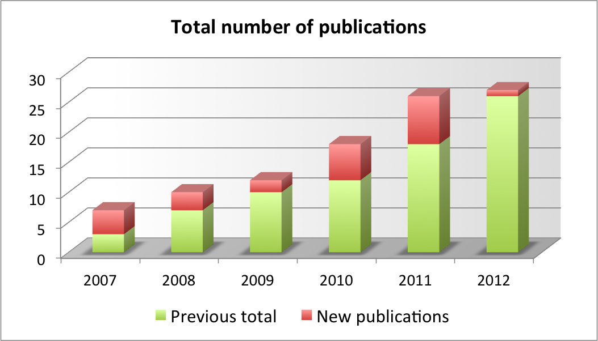

========
About me
========

Contact
-------

* Cell: (001) 775 453 3613
* Estonian number (redirected to my US cell): 712 3613
* E-mail: david.pugal[ät}gmail.com 
* Skype: david_quantum 

Postal address:
	David Pugal, Mechanical Engineering Dept. (MS 312), University of Nevada, Reno,	Reno, NV 89557

.. See also `facebook <http://www.facebook.com/david.pugal>`_ 

Academic experience
-------------------

I received BA *cum laude* and MA *cum laude* degrees in applied physics
from `University of Tartu
<http://www.ut.ee/>`_ in 2005 and 2008, respectively. During the
undergraduate study I had an opportunity to design and build electronics and
to write low level software for an underwater robot (Ph.D. project of
my former colleague Madis Listak). The results are published in
various peer-reviewed international journals 
and proceedings (see :ref:`publications`).

In 2006 I shifted my focus on more fundamental research, namely,
I started working on developing a physics based model of ionic
polymer-metal composite (IPMC) actuators and sensors. It involved
describing the underlying physics using partial differential equations
with all necessary boundary conditions in a way that the problem
can be solved using finite element method (FEM).
The simulations were carried out using Comsol Multiphysics software.

Overall, my academic work has resulted in :ref:`7 journal articles <journal>`  
and over :ref:`13 conference proceedings <conference>`. The total number
of academic publications with my involvement is shown below:

Work experience
---------------

.. _publications:

List of publications
--------------------

.. _journal:

Journal articles:
^^^^^^^^^^^^^^^^^

* ``Pugal, D.``; Solin, P.; Kim, K.J., Aabloo, A. (2011) `Modeling Ionic Polymer-Metal Composites with Space-Time Adaptive Multimesh hp-FEM <http://dx.doi.org/10.4208/cicp.081110.180311a>`_ *Communications in Computational Physics* **11** (1), 249 - 270
* ``Pugal, D.``; Kim, K.J.; Aabloo, A. (2011) `An explicit physics-based model of ionic polymer-metal composite actuators <http://link.aip.org/link/doi/10.1063/1.3650903>`_ *Journal of Applied Physics* **110** 084904
* Kim, K.J.; ``Pugal, D.``; Leang, K. (2011) `A Twistable Ionic Polymer-Metal Composite Artificial Muscle for Marine Applications <http://dx.doi.org/10.4031/MTSJ.45.4.9>`_ *Marine Technology Society Journal* **45** (4), 83 - 98
* ``Pugal, D.``; Jung, K.; Aabloo, A.; Kim, K. (2010). `Ionic polymer-metal composite mechanoelectrical transduction: review and perspectives. <http://www3.interscience.wiley.com/search/allsearch?mode=viewselected&product=journal&ID=123238505&view_selected.x=35&view_selected.y=15&view_selected=view_selected>`_  *Polymer International*, **59** (3), 279 - 289.
* Park, I.S.; Kim, S.M.; ``Pugal, D.``; Huang, L.; Tam-Chang, S.W.; Kim, K.J. (2010). `Visualization of the cation migration in ionic polymer-metal composite under an electric field <http://dx.doi.org/10.1063/1.3293290>`_ *Applied Physics Letters*, **96**, 043301
* ``Pugal, D.``; Kim, K.J.; Punning, A.; Kasemägi, H.; Kruusmaa, M.; Aabloo, A. (2008). `A self-oscillating ionic polymer-metal composite bending actuator <http://dx.doi.org/10.1063/1.2903478>`_, *Journal of Applied Physics*, **103** (8), 084908
* Kim, D.; Kim, K. J.; Tak, Y.; ``Pugal, D.``; Park, Il-S. (2007). `Self-oscillating electroactive polymer actuator <http://dx.doi.org/10.1063/1.2735931>`_, *Applied Physics Letters*, **90**, 184104

.. _conference:

Conference proceedings:
^^^^^^^^^^^^^^^^^^^^^^^
* Kim, S.J.; ``Pugal, D``; Wong, J.; Kim, K.J.; Yim, W. (2011) `A bio-inspired multi degree of freedom actuator based on a novel cylindrical ionic polymer-metal composite material` *The 15th International Conference on Advanced Robotics (ICAR) 2011*, Tallinn, Estonia
* ``Pugal, D.``; Kim, K.J.; Leang, K.K.; Palmre, V. (2011) `Modeling and designing IPMCs for twisting motion: electromechanical and mechanoelectrical transduction` *Electroactive Polymer Actuators and Devices (EAPAD) 2011*, Proc. SPIE **7976**, p. 79761S. San Diego, CA, USA
* ``Pugal, D.``; Kim, K.J.; Solin, P.; Aabloo, A. (2011) `A novel hp-FEM model for IPMC actuation` *Behavior and Mechanics of Multifunctional Materials and Composites 2011* Proc. SPIE **7978**, p. 79780E. San Diego, CA, USA
* Kim, S.J; ``Pugal, D``; Jung, Y; Wong, J; Kim, K.J; Yim, W. (2010). `A Rod-Shaped Ionic Polymer-Metal Composite for Use as an Active Catheter-Platform. <http://link.aip.org/link/abstract/ASMECP/v2010/i44168/p145/s1>`_ *ASME 2010 Conference on Smart MAterials, Adaptive Structures and Intelligent Systems (SMASIS2010)* **2010** (44168) 145-151. Philadelphia, PA, USA
* ``Pugal, D``; Kim, S.J.; Kim, K.J.; Leang, K.K. (2010). `IPMC: recent progress in modeling, manufacturing, and new applications. <http://dx.doi.org/10.1117/12.848281>`_ *Electroactive Polymer Actuators and Devices (EAPAD) 2010* Proc. SPIE **7642**, p.76420U. San Diego, CA, USA
* ``Pugal, D``; Kim, K.J; Aabloo, A. (2010). `Modeling the transduction of IPMC in 3D configurations. <http://dx.doi.org/10.1117/12.847958>`_ *Behavior and Mechanics of Multifunctional Materials and Composites 2010* Proc. SPIE **7644**, p.76441T. San Diego, CA, USA
* ``Pugal, D``; Aabloo, A; Kim, K.J; Jung, Y. (2009). `Modeling IPMC Material With Dynamic Surface Characteristics. <http://www.asmedl.org/dbt/dbt.jsp?KEY=ASMECP&Volume=2009&Issue=48975>`_ *ASME 2009 Conference on Smart Materials, Adaptive Structures and Intelligent Systems (SMASIS2009)* **2** 115-122. Oxnard, CA
* ``Pugal, D.``; Aabloo, A.; Kim, Kwang J (2009) `Dynamic surface resistance model of IPMC <http://dx.doi.org/10.1117/12.815824>`_, *Behavior and Mechanics of Multifunctional Materials and Composites 2009* Proc. SPIE, **7289**, p.72891E. San Diego, CA, USA
* ``Pugal, D.``; Kasemägi H.; Kruusmaa M.; and Aabloo A. (2008). `An advanced finite element model of IPMC <http://dx.doi.org/10.1117/12.776610>`_, *Electroactive Polymer Actuators and Devices (EAPAD) 2008* Proc. of SPIE **6927** p.692711. San Diego, CA, USA 
* ``Pugal, D.``; Kasemägi, H.; Kim, KJ, Kruusmaa, M.; and Aabloo, A. (2007). `Finite element simulations of the bending of the IPMC sheet <http://dx.doi.org/10.1117/12.715966>`_, *Electroactive Polymer Actuators and Devices (EAPAD) 2007* Proc of SPIE **6524**, p.65240B. San Diego, CA, USA
* Listak, M.; ``Pugal, D.``; Kruusmaa, M. (2007). Computational Fluid Dynamics Simulations of a Biomimetic Underwater Robot, *13th International Conference on Advanced Robotics*  Korea, Jeju, 21-24 August, 2007. IEEE, 2007, 314 - 319
* Listak, M.; ``Pugal, D``; Kruusmaa, M (2007). Biomimetic fish-like underwater robot for shallow water applications, *13th International Conference on Advanced Robotics*, Korea, Jeju, 21-24 August, 2007. IEEE, 2007, 332 - 336
* Listak, M.; Martin, G.; ``Pugal, D.``; Aabloo, A.; Kruusmaa, M. Design of a semiautonomous biomimetic underwater vehicle for environmental monitoring *6th IEEE International Symposium on Computational Intelligence in Robotics and Automation (CIRA 2005)*; Espoo, Finland; June 2005 IEEE, 2005, 9-14

Conference presentations
^^^^^^^^^^^^^^^^^^^^^^^^
* ``Pugal, D.``; Solin, P.; Kim, K.J.; (2011) "Using *hp*-FEM to Model Actuation of IPMC Materials" *3rd International Conference on Computational Methods in Engineering and Science (FEMTEC2011)*, May 9-13, South Lake Tahoe, CA, USA 
* ``Pugal, D.``; Jung, Y.; Aabloo, A.; Kim, K.J (2009) "Efficient Model Of The Electrodes of IPMC", *ASME International Mechanical Engineering Congress & Expo 2009*, November 13-19, Lake Buena Vista, FL, U.S.A, *Technical Presentation*

Misc
^^^^
* Listak, M.; Martin, G.; ``Pugal, D.``; Aabloo, A.; Kruusmaa, M.; (2005) Task-oriented Design of an Underwater Vehicle for Environmental Monitoring in The Baltic Sea. *Proceedings of the IARP: International Workshop on Underwater Robotics (IWUR 2005)*; Genova, Italy; November 2005, Genova: IARP
* ``Pugal, D.``; Listak, M. (2005). Allveerobot Läänemere keskkonnaseireks. *A & A*, **5**, 22 - 31.
