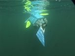
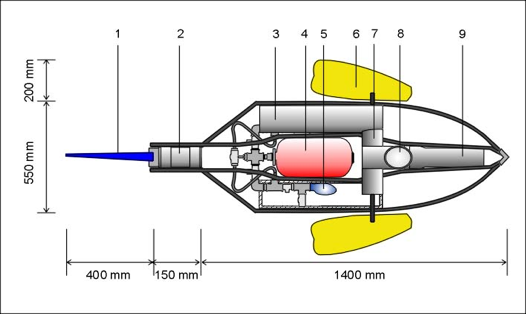
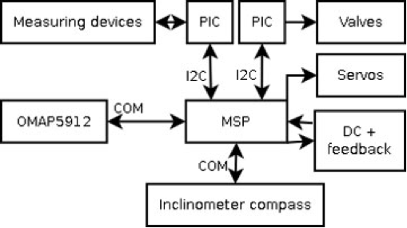

Biomimetic underwater robot
---------------------------

We investigated a biomimetic underwater 
robotics with fin propulsion for shallow water applications. 
Biomimetic underwater robot design permits 
creating devices that are efficent, quiet, create 
little or no turbulence and have good maneuverability.

The aim was to create such a device for shallow water applications. 
Many costal regions and inland water bodies are shallow and at 
the same time have a muddy bottom and low visiblity. 
Visual inspection of in these environemnts requires devices 
that do not create turbulence while capable of moving 
without beating up the silt.
The fish-like biomimetic robot with control surfaces would be 
capable of good maneuverability even in an unsteady flow (surges and waves).

Electronics and control
^^^^^^^^^^^^^^^^^^^^^^^

My main task was to design and build electronics for the
control surfaces and underwater sonars. The robot
has a three-level control system. 

The first level is Texas Instrument's OMAP5912
Strong-ARM based microcomputer, which communicates
with the the offboard PC and is responsible for programming
dive plan for the next layer. It also records and pre-processes
video input.

The second level is Texas Instrument MSP430 micro processor. 
It receives the dive plan from the upper level Strong-Arm OMAP5912 via a
serial port. The main task of this control level is to follow the
dive plan by controlling the actuators, and to collect inputs
from sensors. 
The third level consists of an array of PIC processors that
control the actuators and sensors. 
Some actuators have builtin PIC microprocessors 
while others (like valves) have
external PIC processors. Communication between MSP430
and PIC processors is done via I2C protocol.

Active control of robot is done by MSP430, which is
responsible for interpreting the dive plan, forwarding
commands to lower level PIC controlled devices and
communicating the results back to the upper level 
OMAP5912. Since MSP430 has many PWM outputs, it is
also directly driving the 2 servomotors and reading the tail
position from the angle decoder connected to the DC motor
of the tail.

Operator can program mission in a flexible way
writing a program like: “turn left”, “go forward”, “give a
temperature reading”, etc.

Additionally, some basic fluid dynamcis calculations were
carried out in order to estimate water drag on the robot
and required towing force.

.. seealso::

	:doc:`Some images and schematics <robotpics>`

Fluid dynamics calculations
^^^^^^^^^^^^^^^^^^^^^^^^^^^

fafa

.. seealso::

	`Papers and downloads <http://www.ims.ut.ee/mediawiki/index.php/Our_publications#An_Underwater_vehicle_for_environmental_monitoring>`_

	`Project page <http://www.ims.ut.ee/mediawiki/index.php/Biomimetic_Underwater_Robot>`_

